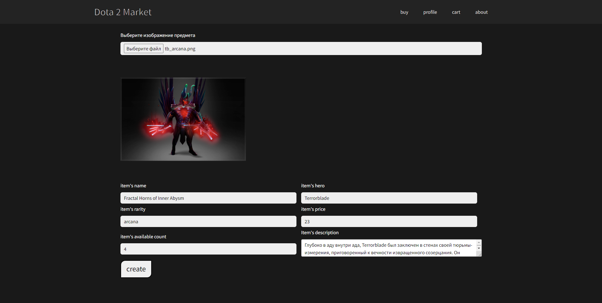

# Showcase
## Create item page

## Catalog page

# How to run:
* run `npm install`
* then `npm build` / `npm run`
* if you want to serve : `npm install -g serve`
* serve : `cd build` -> `serve -s build` or `npm start`
